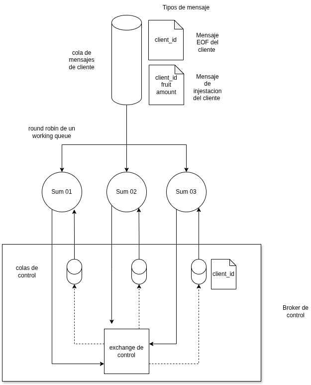
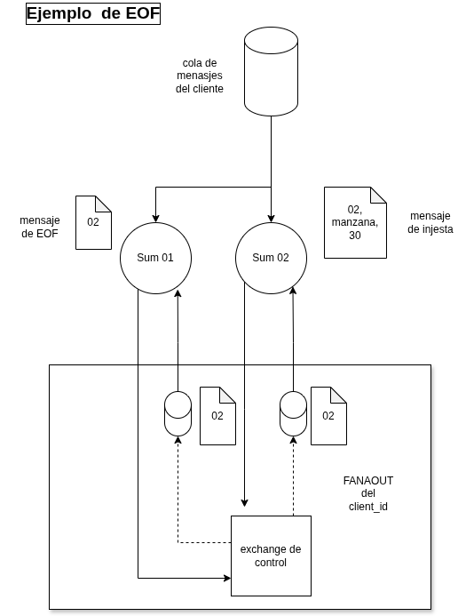
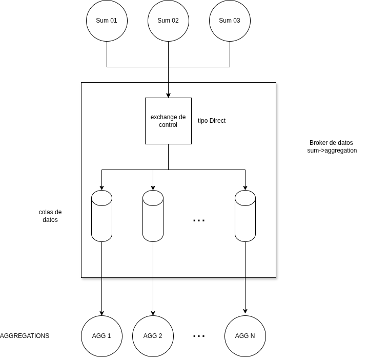

# Tp Coordinacion

---

En este trabajo practico, los Sum consumen datos de los clientes a travez de una working queue de forma compartida, esta cola es la encargada de distribuir el trabajo entre las distintas instancias de Sum usando un algoritmo de round robin, por ende ninguno sabe que paquete le va a llegar. Como nuestro sistema recibe mensajes de pares de frutas y cantidades, como tambien notificaciones de finalizacion de la ingesta de datos, todos ellos llegan con el id del cliente que los envio.

Ante este problema es necesario un mecanismo de sincronizacion para que cada instancia de Sum pueda detectar el final de la ingesta de datos y enviar los resultados a los Aggregators.

Para eso se utlizo un exchange (Exchange de control) y colas de RabbitMQ por cada instancia de Sum (Cola de control). Su mecanismo es asi
Sum tiene 2 threads, uno para la lectura de datos y el otro para el manejo de EOF y el envio de datos procesados a los Aggregators.

Cuando un Sum recibe un mensaje de EOF por la cola de datos, envia un mensaje de EOF a su exchange, este mensaje es recibido por todas las colas de los Sum. 
Asi que cuando al Sum le llega un mensaje de EOF por la cola de control de RabbitMQ, este primero tiene que verificar si tiene un mensaje en la cola de datos, si es asi, lo procesa para que no haya un dato perdido, y luego envia un mensaje con el resultado a los Aggregators

Para enviar los datos a los aggregators y hacerlo de forma eficiente, se implementa un mecanismo de agrupamiento de frutas por nodos, estas se agrupan por la primera letra de la fruta, de esta forma cada Sum se encarga de enviar un subconjunto de frutas a cada Aggregator evitando asi el procesamiento redundante en los Aggregators
Por ejemplo si tengo la fruta manzana, esta se va a enviar al Aggregator que se encarga de las frutas que empiezan con la letra M, y asi con el resto de las frutas. Si terngo Anana, esta se va a enviar al Aggregator que se encarga de las frutas que empiezan con la letra A.
Esto lo hace mediante un exchange que es de tipo Direct
Del lado de lso Aggregators, cada uno tiene una cola de RabbitMQ a la que se suscribe para recibir los datos de los Sum, y cada uno se encarga de procesar los datos que le llegan y calcular el top parcial, para luego enviarlo al Joiner.

Para el procesamiento de datos de los aggregators, se implementa un mecanismo de sincronizacion por contador, cada vez que un aggregator recibe un mensaje de EOF de un Sum, incrementa su contador, y cuando el contador es igual a la cantidad de Sum, el Aggregator sabe que ya recibio todos los datos de los Sum y puede calcular el top parcial y enviarlo al Joiner
Cabe aclarar que cada instancia de Sum envia un mensaje de EOF a cada Aggregator. 

*Fig. 1: Diagrama de Sum*

*Fig. 2: Ejemplo de EOF*

*Fig. 3: Ejemplo de Aggregators*